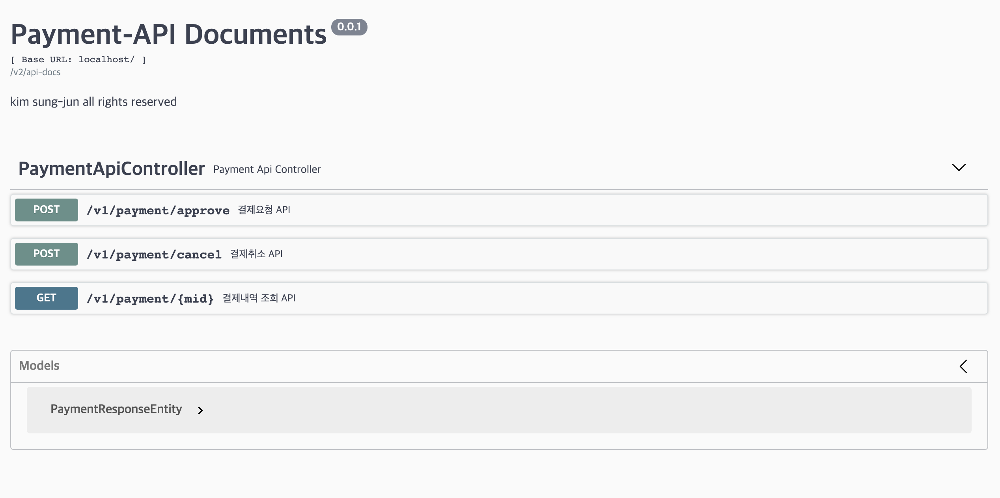

# Payment API
## 1. 개발 스펙
- Backend
    - Java 1.8
    - Spring Boot 2.2.7
    - Gradle
    - Embedded MongoDB (DB)
    - Embedded Redis (cache)
    - Swagger UI
    - Lombok
    - 암호알고리즘 AES256
    - Bash shell (실행 스크립트)
    - Docker, Docker Compose    
    - Nginx (reverse proxy)


## 2. 주요 기능
- API 문서 확인
    - 접속 URL : [Swagger API Docs](http://localhost/swagger/index.html)
- 구현기능    
    - 각 요청에 대한 파라미터 유효성 검증
    - 결제정보조회API
        - 카드번호 앞 6자리, 뒤 3자리 마스킹 처리
    - 결제요청API
        - 동일카드번호(cardNumber)에 대한 중복요청은 1회만 처리
        - 카드번호 암호화 (AES256)        
    - 결제취소API
        - 동일 관리자번호(mid)에 대한 중복요청은 1회만 처리        
        - 전체취소기능
        - 전체취소는 1회만 가능
        - 부분취소기능
- 단위테스트
    - 부분취소 테스트케이스
    - 동시성 테스트케이스


## 3. Swagger
| API Documents 접속 URL : [Swagger API Docs](http://localhost/swagger/index.html)                           |
| ---------------------------------------------------------------------------------------------- |
| [](./screenshots/screenshot-swagger.png) |


## 4. 테스트케이스
- 부분취소 테스트 케이스 1 : /payment-api/src/test/java/com/payment/PaymentAppApplicationTests1.java
- 부분취소 테스트 케이스 2 : /payment-api/src/test/java/com/payment/PaymentAppApplicationTests2.java
- 부분취소 테스트 케이스 3 : /payment-api/src/test/java/com/payment/PaymentAppApplicationTests3.java
- 결제요청 테스트 : /payment-api/src/test/java/com/payment/ApproveMultiThreadTests.java
- 결제취소 테스트 : /payment-api/src/test/java/com/payment/CancelationMultiThreadTests.java


## 4. Payment-API Application 실행방법
- 테스트 환경 조건
  - JDK 1.8 버전 설치 필요
  - Docker 설치 필요
- 테스트 환경 설정 `(MAC OS 예시)`
- JDK 설치
```bash
# JDK8 다운로드
https://www.oracle.com/java/technologies/javase-jdk8-downloads.html
```
- docker 설치
```bash
# Docker Desktop for Mac 다운로드
https://hub.docker.com/editions/community/docker-ce-desktop-mac/
``` 
- check out 받은 깃헙 디렉토리에서 아래 스크립트 파일 수행
- `실행명령어 ./payment-api.sh start` 수행 후 서버가 뜨기까지 수십초 시간이 소요되므로 해당 명령어 수행 후 약 `1분` 이 후 [접속URL](http://localhost/swagger/index.html)로 접속해 주시기 바랍니다. 
```bash
# Payment-API 실행 명령어
$ ./payment-api.sh start
```
```bash
# Payment-API 종료 명령어
$ ./payment-api.sh stop
```
- IDE(Intellij, STS..)에서 실행시
```bash
# 8081포트로 브라우저 호출 (http://localhost:8081/)
```


## 5. Contact
e-mail : arduous1130@gmail.com
